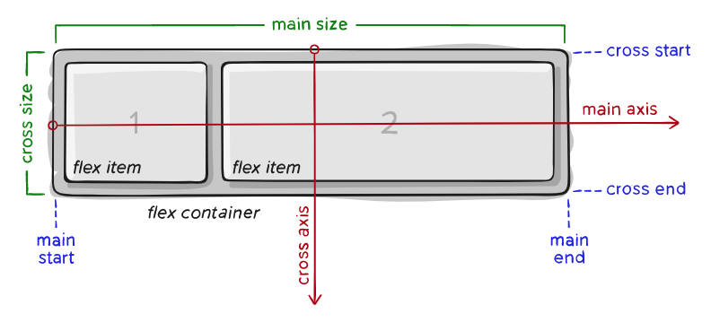
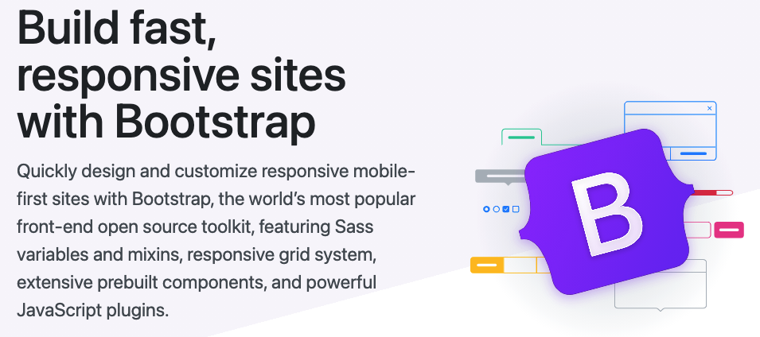

CSS layout

* 웹 페이지에 놓일 요소들을 어떻게 제어할지

# Float

* 실수가 아닌 띄워져 있는 요소를 의미
* 한 요소가 정상 흐름으로부터 빠져 텍스트 및 인라인 요소가 그 주위를 감싸 요소의 좌 우 측을 따라 배치 되어야 함을 지정
* 본래는 이미지를 한쪽으로 띄우고 텍스트를 둘러싸는 레이아웃을 위해 도입
* 더 나아가 이미지가 아닌 다른 요소들에도 적용해 웹사이트의 전체 레이아웃을 만드는 데까지 발전

## Float 속성

* none: 기본 값
* left: 요소를 왼쪽으로 띄움
* right: 요소를 오른쪽으로 띄움

```html
<style>
    .box {
      width: 150px;
      height: 150px;
      border: 1px solid black;
      background-color: crimson;
      margin: 20px;
    }
    .left {
      float: left;
    }
    .right {
      float: right;
    }
  </style>
</head>
<body>
  <div class="box left">float left</div>
  <div class="box left">float left</div>
  <div class="box right">float right</div> 
```

* 위처럼 클래스를 정의 후 float 시킬 다른 클래스와 함꼐 사용

## Float clear

* Float을 사용하면 다른 블록 요소와 겹쳐지게 되는 현상이 발생함
* 이 문제를 해결해 주는 것을 Float clear라고 함
* float된 요소에 가상의 요소를 덧대어 주면서 물리적으로 겹치는 것을 막음
* float된 요소의 **부모**태그에 작성
* ::after를 사용
* Clear 속성은 float 및 비 float 요소 모두에 적용됨
  * 선행요소가 clear가 되면 이것을 무시할 거라고 지시

```html
  <style>
    .clearfix::after {
      content: "";
      /* 기본 값이 인라인이므로 블락으로 변경 */
      display: block;
      clear: both;
    }
  </style>
</head>
<body>
  <div class="clearfix">
    <div class="box1 left">div</div>
  </div>
  <!-- 가상의 요소 생성 -->
  <div class="box2">div</div>
```

## Float 정리

* flexbox, grid 레이아웃과 같은 기술이 나오기 이전에 float은 열 레이아웃을 만드는 데 사용됨

* 두 기술의 출현과 함께 결국 원래 텍스트 블록 내에서 float 이미지를 위한 역할로 돌아감

  * MDN에서는 더 새롭고 나은 레이아웃 기술이 나와있으므로 legacy 레이아웃 기술로 분류

* 예전 기술이라 안 쓰이는게 아니라 웹에서 여전히 사용하는 경우도 있음 (ex, 네이버의 navigation bar)

  

# Flexbox

## CSS Flexible Box Layout

* 오랫동안 CSS 레이아웃을 작성할 수 있는 도구는 Float과 positioning 뿐이었음
  * 문제가 있는 것은 아니었지만, 어떤 면에서 제한적이고 한계가 있음
* Flexbox라 불리는 Flexible Box 모듈은 Flexbox 인터페이스 내의 아이템 간 공간 배분과 강력한 정렬 기능을 제공하기 위한 1차원 레이아웃 모델로 설계
* 요소간 공간 배분과 정렬 기능을 위한 1차원(단방향) 레이아웃
* 그러니까 하나의 박스 내의 아이템들을 정렬하게 해주는 기술
* 요소와 축이 중요

### 요소

* Flex container (부모 요소)
* Flex Item (자식 요소)

### 축

* main axis (메인 축) : 디폴트 x. 방향 설정에 따라 y가 메인일 수도 있음
* cross axis (교차 축) : 메인 축을 교차하는 축

## Flexbox 구성 요소

* Flex container (부모 요소)
  * flexbox 레이아웃을 형성하는 가장 기본적인 모델
  * Flex item 들이 놓여 있는 영역
  * 생성하려면 display 속성을 flex 혹은 inline-flex로 지정
* Flex Item (자식 요소)
  * 컨테이너의 컨텐츠
  * item은 부모로 컨트롤함



## Flex에 적용하는 속성

* 배치 방향 설정

  ```
  flex-direction
  ```

  * flex 메인 축의 방향을 설정

* 메인 축 방향 정렬

  ```
  justify-content
  ```

* 교차축 방향 정렬

  ```
  align-items, align-self, align-content
  ```

* 기타

## flex direction

* 메인 축 방향만 바뀐다.

* flexbox는 단방향 레이아웃이기 때문이다

  이미지

## justify & align

* justify : 메인 방향 정렬
* align : 메인에 교차하는 방향 정렬

## content & items & self

* content
  * 여러 줄
* items
  * 한 줄
* self
  * flex item 개별 요소

## Flex에 적용하는 속성

* 배치 방향 설정
  * flex-direction

* justify-content : 메인축 기준 여러 줄 정렬
* align-items : 교차축 기준 한 줄 정렬
* align-self : 교차축 기준 선택한 요소 하나 정렬

* 자세한 코드 실습 내용은 [flexbox.html](./02_flexbox.html) 참조

## 정리

* flex-direction
  * item이 쌓이는 방향 설정
  * main-axis를 변경
  * row (기본 값) : 메인 축의 방향이 왼쪽에서 오른쪽
  * row-reverse : 메인 축의 방향이 오른쪽에서 왼쪽
  * column : 메인 축의 방향이 위에서 아래
  * column-reverse: 메인축의 방향이 아래에서 위
* flex-wrap
  * 요소들이 강제로 한 줄에 배치될 것인지 결정
  * nowrap (default): 모든 아이템들 한 줄에 나타내려고 함
    * 그래서 자리가 없으면 튀어 나옴
  * wrap 넘치면 다음 줄로 넘김
  * wrap-reverse : 넘치면 그 윗줄로 역순
* flex-flow
  * flex-direction과 flex-wrap의 shorthand
  * flex-direction과 flex-wrap에 대한 설정 값을 차례대로 작성
  * 예시 ) flex-flow: row nowrap;
* justify-content : 메인 축 정렬
* align-items: 교차 축 정렬
* align-self: 개별 아이템 정렬. 부모 컨텐트 밖에서 사용
* order: 작은 숫자일 수록 앞으로 이동
* flex-frow
  * 메인축에서 남은 공간을 각 아이템에 분배하는 방법
  * 남은 공간을 비율로 나눠 아이템에 더하는 것.

# BootStrap

## The most popular HTML, CSS and JS library in the world

* 트위터에서 시작된 오픈 소스 프런트 엔드 라이브러리
* 웹 페이지에서 많이 쓰이는 요소 거의 전부를 내장하고 있음
* 별도의 디자인을 할 시간이 크게 줄어들고, 여러 웹 브라우저를 지원하기 위한 크로스 브라우징에 불필요한 시간을 사용하지 않도록 함
* one source multi use
  * 반응형 웹 디자인 (ex, AIRBNB)



* 전세계 FE 오픈소스 중 9번째로 많이 사용되고 있음
* 실용례
  * NETFLIX, VOGUE KOR
  * Wappalyzer을 사용하면 무슨 프레임 워크를 사용해서 개발했는지 알 수 있음

## HTML vs Bootstrap

## 초기화

### 사용배경

* 모든 브라우저는 각각의 스타일을 가지고 있는데 브라우저마다 이게 각각 다름
* 그래서 서비스를 할 때 브라우저마다 출력결과가 달라지는 문제가 발생
* 그래서 모든 브라우저에서 공통된 스타일이 나올 수 있도록 초기화 해주는 방법이 필요

### Normalize CSS

* gentle solution
* W3C를 기준으로 브라우저 중 하나가 불일치 한다면 차이가 있는 브라우저를 수정한다.
* 만약 수정할 수 없는 경우 수정할 수 없는 브라우저에 나머지 브라우저를 맞춘다.
* BootStrap에서 사용하는 방법

### Reset CSS

* 브라우저의 기본 스타일을 깡끄리 무시
* Reset CSS의 문제점은 모든 선택자가 엉켜있고, 불필요한 오버라이드가 많이 발생하여 디버깅시 제대로 읽을 수 없다.

## Cross Browsing

동일이 아닌 동등의 개념

## BootStrap 사용 방법

1. 파일 다운로드. 그 밖에...

### CDN

* Content Delivery Network
* 컨텐츠(CSS, JS, Image, Text 등)를 효율적으로 전달하기 위해 사용자와 가장 가까운 서버에서 컨텐츠를 전달.
* 장점
  * 가까운 서버를 통해 빠르게 전달 가능
  * 분산된 외부 서버를 활용함으로서 본인 서버의 부하가 적어짐
* 인터넷 트래픽의 절반 이상이 CDN을 통해 이루어짐

## spacing

```css
.mt-1 {
    margin-top: 0.25 rem !important;
}
```

```css
.mx-0 {
    margin_right: 0 !important;
    margin_left: 0 !important;
}
```

위와 같은 spacing 클래스들이 bootstrap에 적용되어 있음

## color

* bootstrap에는 html과는 다른 시그니처 색상이 정의되어 있음

## Flexbox in Bootstrap

* d-flex라는 클래스 이름으로 시작.
  * display: flex의 구현 클래스
* 기존 flex와 동일하게 사용

## Responsive Web

* Bootstrap을 활용하면 다양한 화면 크기에 대응할 수 있는 반응형 웹을 디자인할 수 있음.
* 별도의 기술 이름이 아니라 웹 디자인에 대한 접근 방식
* 반응형 레이아웃 작성에 도움이 되는 사례들의 모음 등을 기술하는게 사용하는 용어
* 예시
  * Media Queries, Flexbox, Bootstrap Grid System, The view point meta tag

## Grid System

* Flexbox로 내부적인 구현이 되어있음
* container, rows, column으로 컨텐츠를 배치하고 정렬
  * flex : container -> items
  * grid sys : container -> rows -> columns
* 반드시 기억해야 할 2가지!
  1. 12개의 컬럼
     * 적당한 숫자 중 약수가 많은 편
     * 그만큼 배율을 다양하게 나누기 좋음
  2. 6개의 grid breakpoints

## Grid system class

* row
  * columns의 wrapper
* gutter
  * grid 시스템에서 반응적으로 공간 확보하고 정렬하는 데 사용되는 column 사이의 패딩
* col, col-*
  * column class는 row당 가능한 12개 중 사용하려는 columns의 수를 나타냄
  * columns의 너비는 백분율로 설정 되므로 항상 부모 요소를 기준으로 유동적으로 크기가 조정됨
  * grid layout에서 내용은 반드시 columns 안에 있어야 하며
    오직 columns만 row의 바로 하위 자식일 수 있습니다.

## Grid breakpoints

* 다양한 디바이스에서 적용하기 위해 특정 픽셀 조건에 대한 지점을 정해 두었는데 이를 break points라고 함 (ex, 가로 1000픽셀 이하면 모바일로 간주)

```html
....
    <h2 class="text-center">Grid breakpoints</h2>
    <div class="row">
      <div class="box col-2 col-sm-8">1</div>
      <div class="box col-8 col-sm-2">2</div>
      <div class="box col-2 col-sm-2">3</div>
    </div>
    <hr>
...
```

## Grid Nesting

* 별도의 구현이 필요한게 아니라 들여쓰기 단위로 묶어서 사용

```html
...
    <h2 class="text-center">nesting</h2>
    <div class="row">
      <div class="box">
        <div class="row">
          <div class="box">1</div>
          <div class="box">2</div>
          <div class="box">3</div>
          <div class="box">4</div>
        </div>
      </div>
      <div class="box">1</div>
      <div class="box">2</div>
      <div class="box">3</div>
    </div>
...
```


## Grid Offset

* 밀어내기
* 지정한 만큼의 column 공간을 무시하고 그 다음부터 컨텐츠 사용 가능

